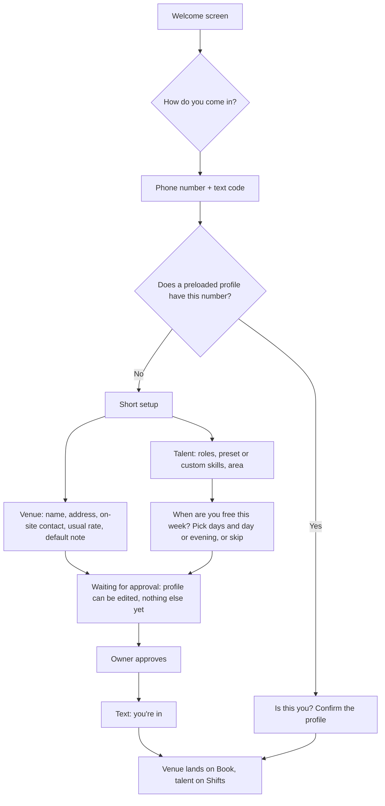
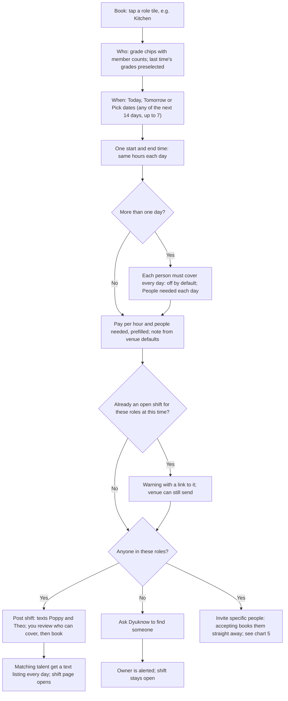
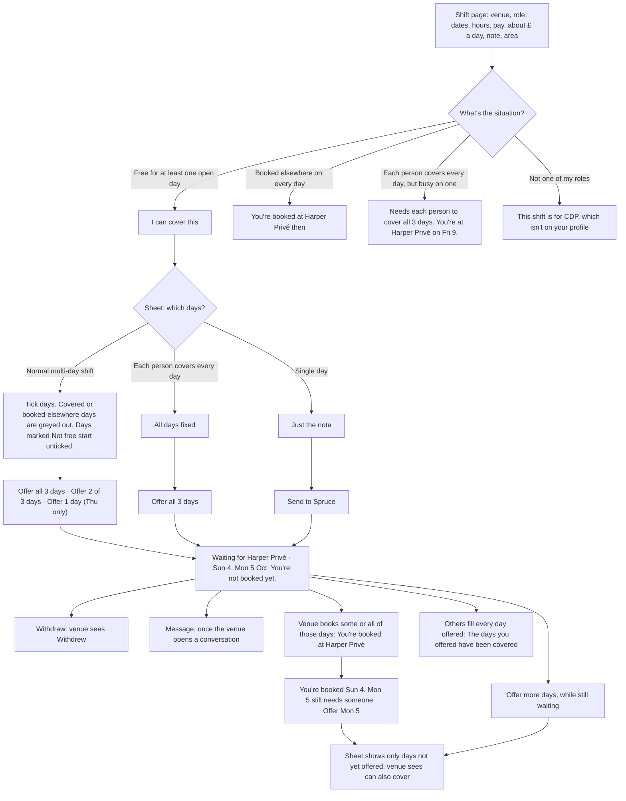
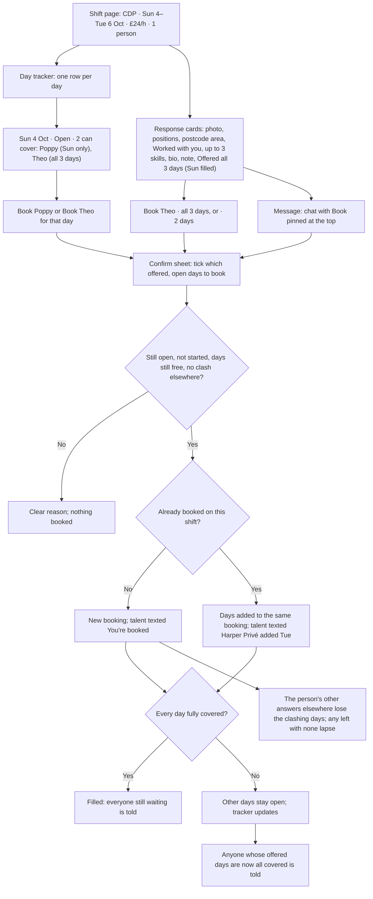
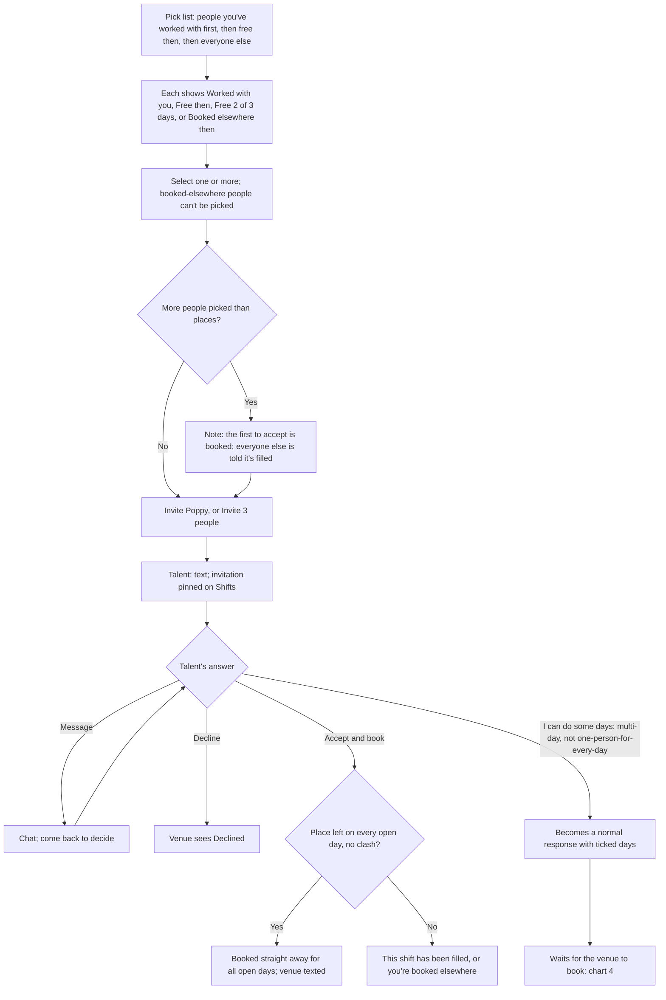
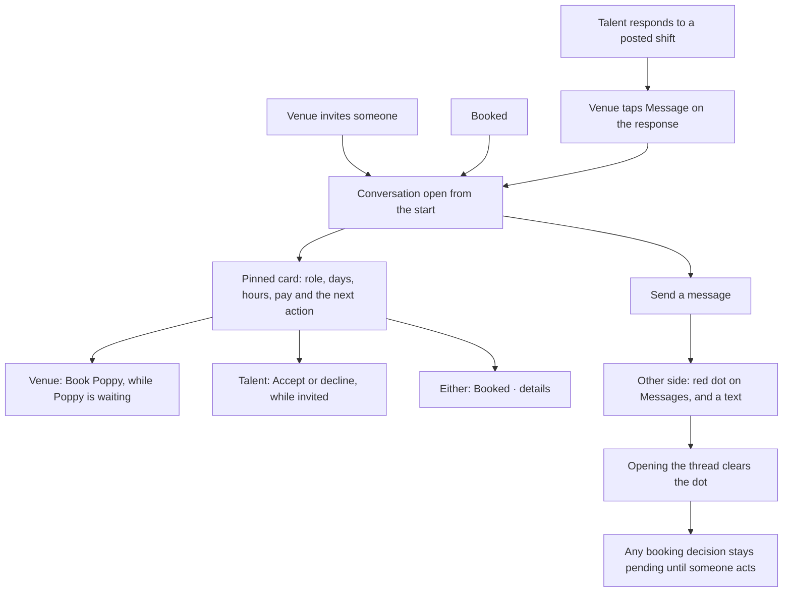
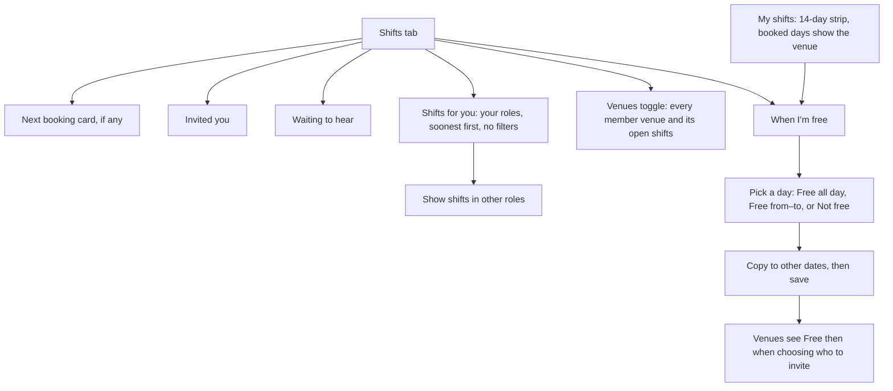
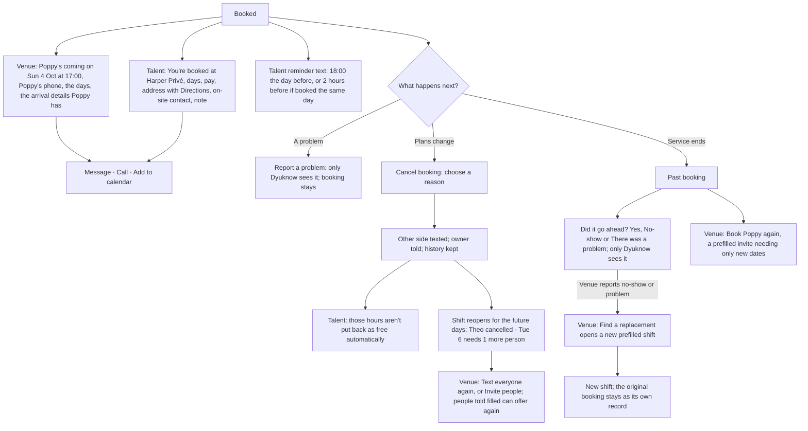
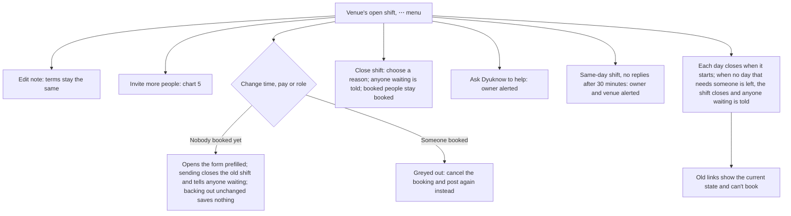
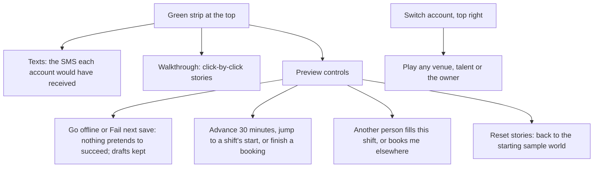

# How the MVP preview works

These charts describe what is built on `MVP-preview` today, from each person's point of view. The product behaviour follows [mvp-user-flow.md](mvp-user-flow.md). Everything runs in this browser's sample world: no real accounts, SMS, payments or backend.

## The rules in one place

- **Two yeses make a booking. Whoever says yes second confirms it.**
  - Posted shift: talent says *I can cover this*, then the venue taps *Book*.
  - Invitation: the venue sends it with full terms, then talent taps *Accept and book*.
- **Nothing ever books automatically.** On a posted shift, the venue always makes the final call.
- **A multi-day shift is a set of days, and the yeses are per day.**
  - Each day has its own start and end. Talent ticks the days they can do.
  - A booking covers only days both sides said yes to. The venue picks which of a person's offered days to book, never more than they offered.
  - The venue can book different people on different days. Adding more of the same person's days extends their booking rather than creating a second one.
  - Days nobody has covered stay open for someone else.
- **"Each person must cover every day" is optional.** When posting more than one day, the venue can switch it on (off by default). With "2 people needed each day" it means two people, each covering every day.
- **Talent can add days later**, even after being booked for some of them.
- **A cancellation reopens the shift** for the future days that now need someone.
- **A shift closes day by day:** a day can't be taken once it has started, and the shift closes when no day that still needs someone is left.
- **Buttons always name the days:** "Offer 2 of 3 days", "Offer 1 day (Thu only)", "Book Theo · all 3 days". Never a bare "Apply".
- **Only a booking reserves time.** Saying you can cover, being invited or chatting reserves nothing. When someone is booked, the clashing days drop out of their other answers.
- **Terms are frozen once sent.** Role, dates, hours and pay can't change. The note can change freely. To change the terms, the venue resends the shift as a new one.
- **Chat never changes terms.** The pinned card at the top of a conversation is the source of truth.

## What each profile shows

Every item comes from a field in [data-model.md](data-model.md); nothing else appears.

- **A talent, as a venue sees them:** photo or initials, name, positions, postcode area ("TW9"), "Worked with you" (only from past bookings), up to 3 skills, bio (first 3 lines on cards), and for a shift the days offered and their note. The full profile adds availability.
- **A venue, as talent see it:** photo, name, postcode area, "Restaurant · Seafood", "30–60 covers · team of 12", "known for" chips, website and Instagram, bio, open shifts. The full address and on-site contact come only once booked.
- **New shifts pre-fill** pay from the venue's kitchen or front-of-house rate, and the note from dress code, uniform and staff meal.
- **Owner only:** a venue's vacancies in a typical week.

## Where things live

| Venue tab | What's there | Talent tab | What's there |
| --- | --- | --- | --- |
| **Book** | Your open shifts with live status, the role tiles, who's coming up | **Shifts** | Next booking, invitations, waiting to hear, shifts for your roles; a Venues toggle |
| **Bookings** | Needs you · Open · Coming up · Past and cancelled (collapsed) | **My shifts** | When you're free (14 days), Coming up, Invited you, Waiting to hear, Past and closed (collapsed) |
| **Messages** | One conversation per shift and person | **Messages** | Same |
| **Profile** | Venue details and the defaults used on new shifts | **Profile** | Roles, skills, bio and shift alerts |

- **Signals:** a red dot on Messages for unread messages. A count on Bookings for responses waiting for the venue, and on My shifts for invitations waiting for talent.
- **No notifications page.** In the real product, texts do that job.
- **Phones:** the tab bar hides on task screens (posting, a shift, a booking, a chat), so the main button stays in reach.

## 1. Joining

A waiting member who opens a shift link can read its terms but can't respond or accept until approved.

## 2. Venue posts a shift

One screen. Tapping a role tile opens it with the team already chosen.

- **Who gets texted:** approved talent who have one of the chosen grades. Talent who set alerts to *Today and tomorrow only* hear only about shifts starting by tomorrow.
- **Drafts:** saved only after a real change. Home shows "Unsent changes to your CDP shift" or "Unsent CDP shift" with Continue or Discard. Opening an edit and backing out leaves nothing behind.
- **Validation:** an overnight shift shows both dates. A start time in the past is refused. Pay below £12.71 an hour shows a warning.

## 3. Talent says "I can cover this"

Talent arrive from the text link, or from **Shifts**. Shift cards lead with the venue's name and photo, the dates ("Thu 8–Sat 10 Oct · 17:00–23:00") and "3 days needed". Shifts for other roles sit behind one button. Hidden from the feed: shifts that clash with a booking on every day, and one-person-for-every-day shifts that clash on any day.

"Not free" comes from the talent's own calendar (chart 7). It's a hint, not a block, because only a booking reserves time.

## 4. Venue reviews and books

The shift page is written for the venue. There is no stock photo, and edit and close live under a ⋯ menu. On multi-day shifts the **day tracker** comes first.

- **"Worked with you"** comes only from recorded work: a past, uncancelled booking at that venue that the venue didn't report as a no-show or problem. Never from a bio or a skill.
- **Mix and match:** for example, Poppy on Sun, then Theo on Mon, then Theo again on Tue. Theo ends up with one booking for Mon and Tue.
- **On a one-person-for-every-day shift:** the tracker shows who's booked but has no per-day Book buttons, and the confirm sheet books every day.
- **Status line:** talks in people per day ("Mon 5, Tue 6 each need 1 more person"), never "days covered".
- **When nobody can be booked:** before anyone is booked it says "No replies yet" with Invite more people and Ask Dyuknow to help. Once someone is or was booked it says "Find cover for Tue 6" with Text everyone again and Invite people.

## 5. Inviting specific people

From **Invite specific people** on the posting screen ("You choose who. Accepting books them straight away."), or **Invite more people** on an open shift.

The invitation screen and its chat show the one role the person was invited for, not the full list of grades.

## 6. Talking

- **Who can start a conversation:** talent can't message a venue first, and nobody can message from a venue or talent profile.
- **What lights the dot:** status lines in a thread ("Booked for Sun 4, Mon 5 Oct") don't count as unread messages.
- **Order:** conversations are listed with the most recent first.

## 7. Finding work and setting availability

- **Not set:** blank days mean the talent hasn't said either way.
- **What availability does:** it helps venues choose who to invite. It doesn't reserve time, and it doesn't control who gets shift texts; alerts follow roles.
- **Bookings win:** a booked day stays blocked whatever the availability says.
- **Not free days:** they start unticked when the talent offers on a multi-day shift (chart 3).

## 8. After booking

Each side gets a booking screen written for them.

- **Cancelling mid-way:** if a multi-day booking has already started, the cancel sheet lists only the remaining days, and the worked days stay in history.
- **Payment** is arranged directly between venue and talent.

## 9. Changing, closing or getting help with an open shift

A shift posted for a role with no members alerts the owner straight away.

## 10. Preview-only tools

These exist only so one person can try both sides. They are not part of the product. **Enter as Spruce** and **Enter as Poppy** on the welcome screen skip sign-in; **Try phone sign-in** shows the real joining path from chart 1 (demo code `123456`).

The clock starts at 1 October 2026, 10:00 London. Two tabs in the same browser share one sample world; separate browsers don't. For step-by-step stories, see [MVP-preview-walkthrough.md](MVP-preview-walkthrough.md) or the in-app Walkthrough.
