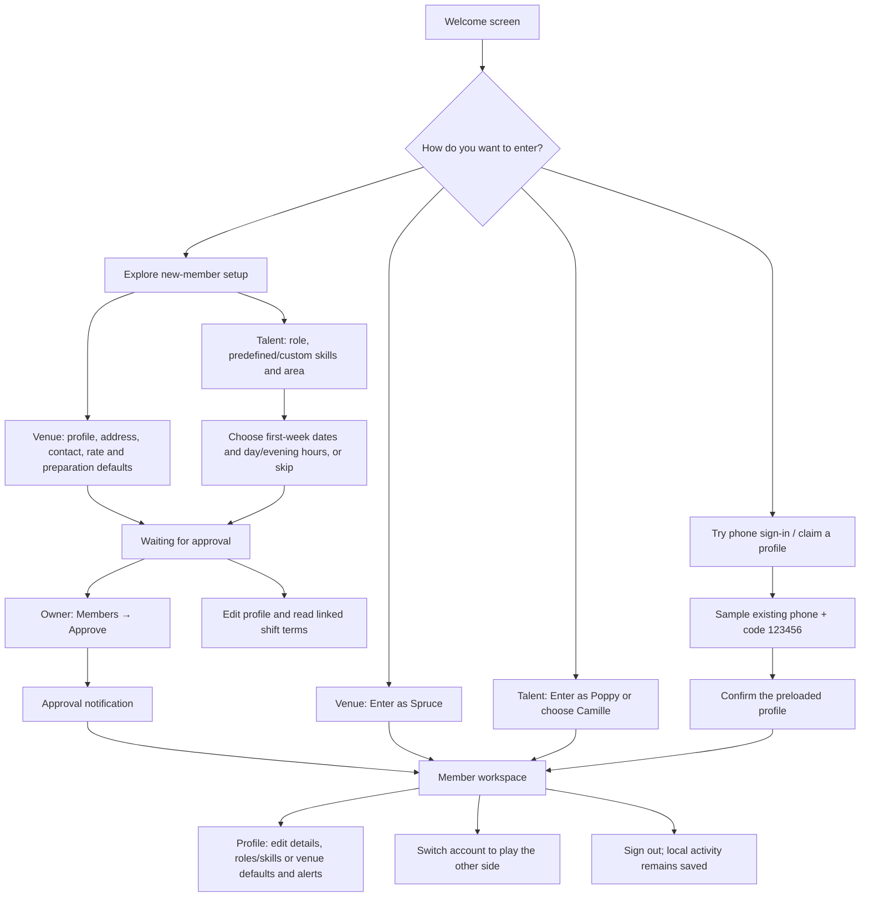
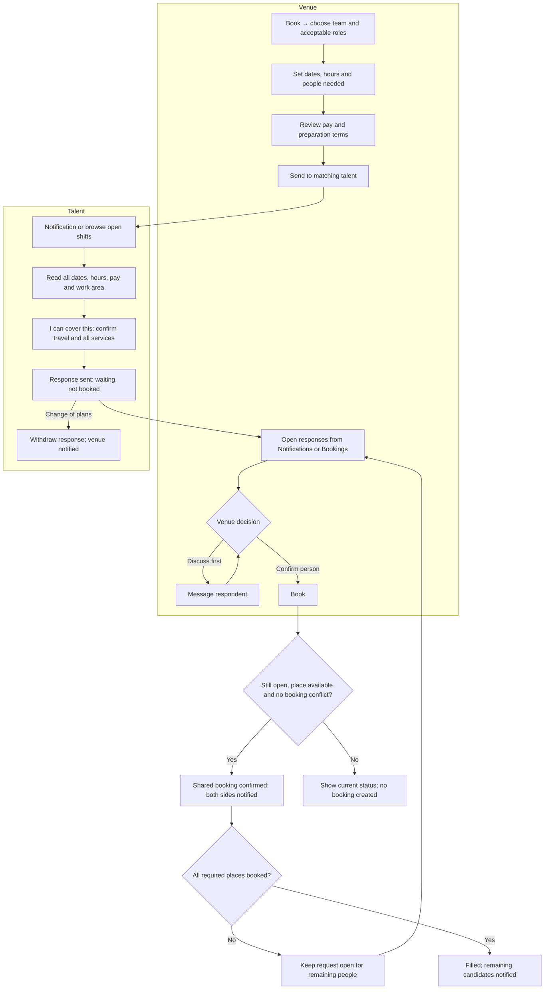
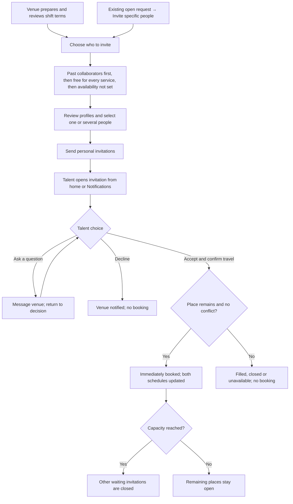
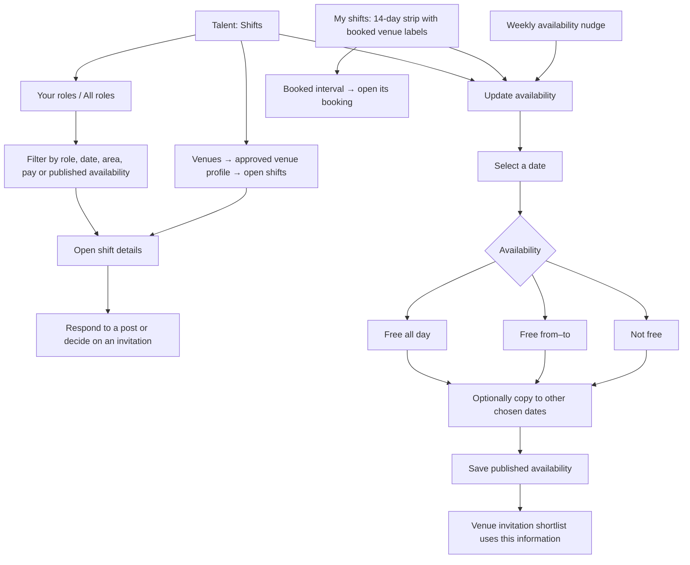
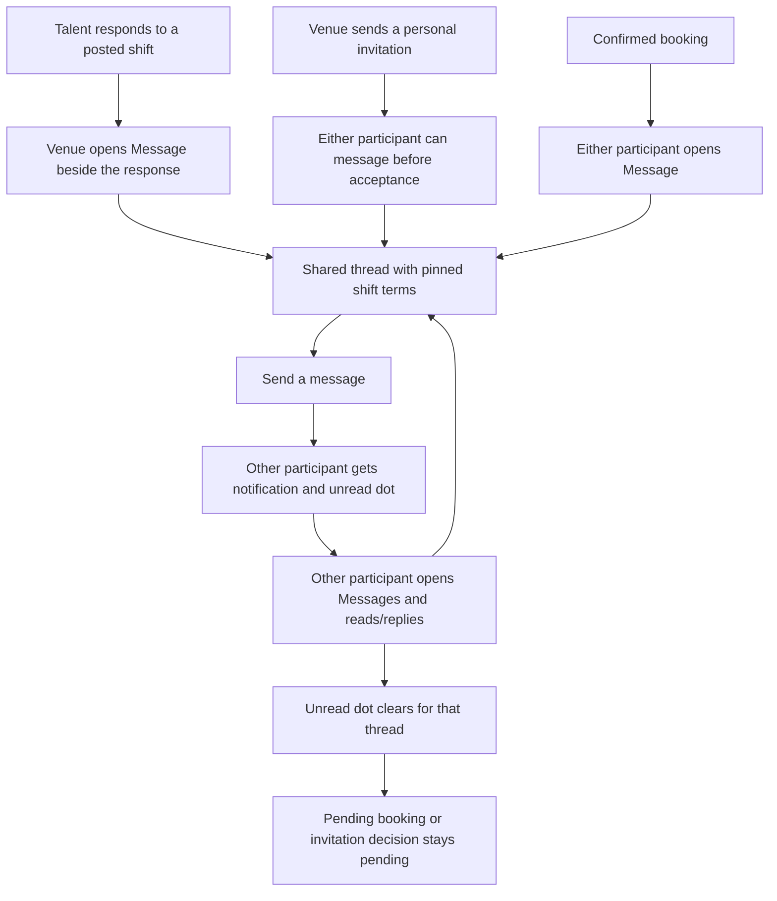
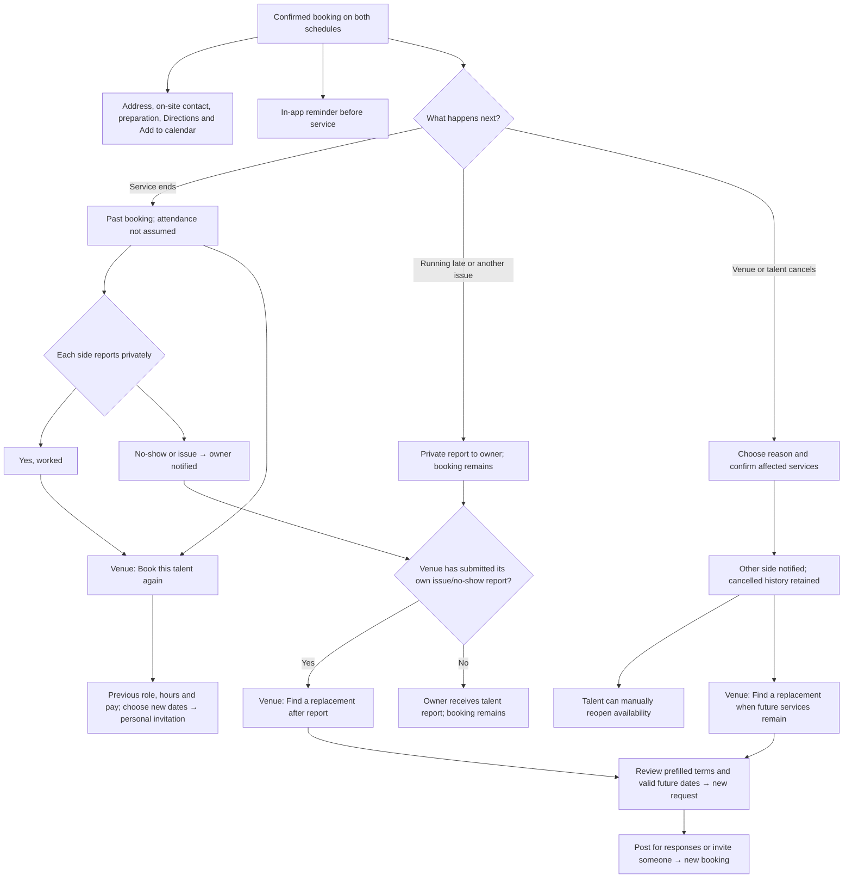
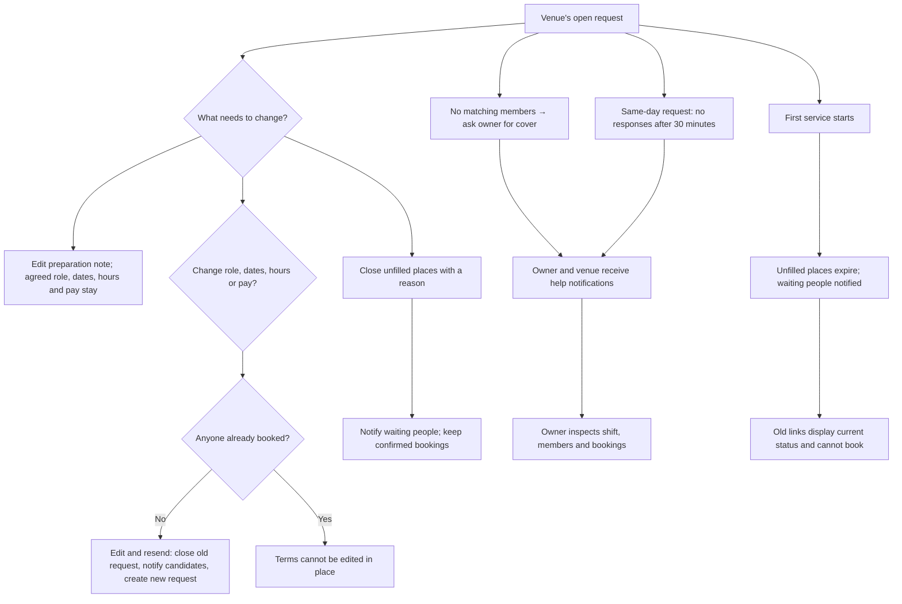
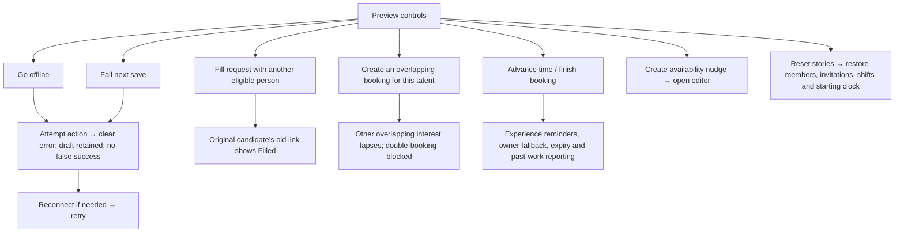

# How the MVP preview can be used

These charts describe the frontend currently implemented on `MVP-preview`. All people, bookings, messages and notifications belong to the browser-local sample world. SMS, real authentication, payments and backend services are not involved.

Two paths confirm a booking: **posted shift → talent responds → venue books**, or **personal invitation → talent accepts**. A response and a message do not reserve time.

## 1. Entry, joining and profiles

You can enter immediately as a sample member, claim a preloaded profile with demo code `123456`, or try the optional joining and owner-approval journey.

## 2. Post a shift and book a respondent

This is the main venue journey. Talent says they can cover; the venue decides whom to book. A request can span 1–7 consecutive dates with the same hours and need 1–5 people. Each person commits to every listed service.

## 3. Invite specific people

The venue has already offered the full terms. Accepting is talent's final yes, so there is no second venue confirmation. Invitations can also be added to an existing posted shift and share its remaining capacity.

For one place and several invitees, the first valid acceptance wins. Skills describe experience; the preview does not create a match score.

## 4. Browse work and publish availability

Talent can find shifts through alerts, filters or venue pages. Availability helps discovery and venue shortlisting; it does not reserve time or stop role alerts by itself. Talent can separately change their role-alert preference in Profile.

Blank dates mean **Not set**. Confirmed bookings block overlapping commitments even when availability was published. Overnight shifts show both calendar dates; times use Europe/London.

## 5. Talk before or after booking

Messaging is tied to a particular request and person. There is no cold-message action in the venue directory or talent profiles.

Messages do not change agreed dates, hours or pay. You switch accounts to write both sides; the preview does not invent automatic replies.

## 6. Work, cancel, replace and book again

Both participants see the same confirmed booking, arrival details and conversation. Either can cancel with a reason; issues and attendance reports go privately to the owner.

Replacement preserves the original booking and report. Cancellation does not silently reopen the original request or republish talent availability. Completed services remain in history. Payment is arranged directly between venue and talent.

## 7. Change an open request or handle missing cover

The venue can revise an unbooked request or close remaining places. The owner is the fallback for missing supply and unanswered same-day requests.

Owner inspection also includes cancellations and private issue reports. The preview generates the help notice; it does not simulate an external phone call or create an automatic replacement worker.

## 8. Explore failures, conflicts and time in the preview

These controls let you experience events that would otherwise require another person or waiting. They operate only on the sample world.

Use **Switch account** or two tabs in the same browser to play both participants. Separate browsers and devices have separate sample worlds. For exact click-by-click stories, see [MVP-preview-walkthrough.md](MVP-preview-walkthrough.md).
