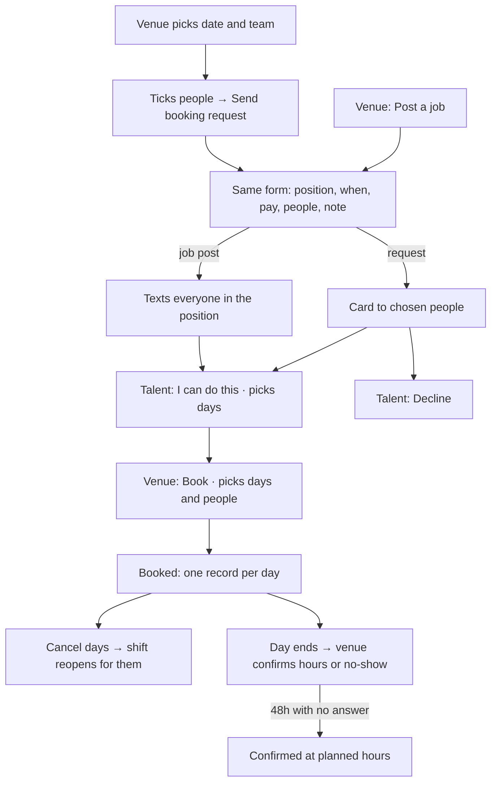
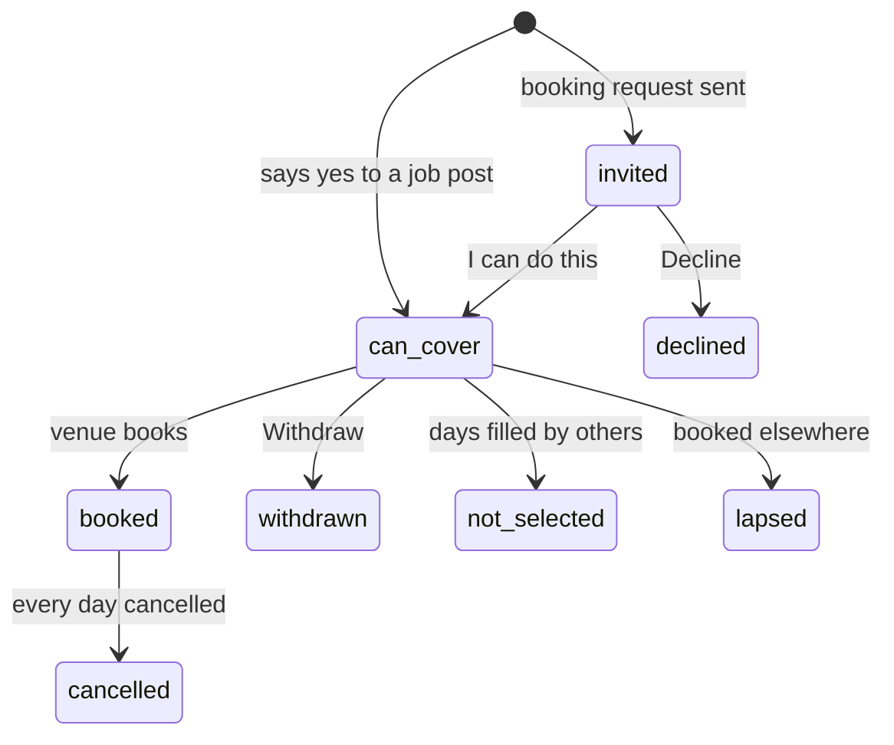

# Dyuknow: MVP user flow

Updated 5 October 2026. This replaces the earlier flow and the separate flowcharts. There is now one way to ask for cover and one way to answer.

Dyuknow is for cover: a service, a day, or up to two weeks. Pay is hourly, set by the venue, and paid by the venue directly. The app records every day worked so payments can run on it later.

## The one rule

> **Talent says yes. The venue books.**

There are two ways for a venue to ask, and they behave the same way:

| | Who it goes to | Talent taps | Venue taps |
| --- | --- | --- | --- |
| **Booking request** | The people the venue picked (one or several) | **I can do this** (and picks days) | **Book** |
| **Job post** | Everyone in the position | **I can do this** (and picks days) | **Book** |

In the model this is one object, a `Shift`, with `mode: "request"` or `mode: "post"`. Both use the same form, the same card, the same answer screen and the same Book button.

- **Saying yes reserves nothing.** Someone can say yes to two clashing shifts. Whichever venue books first wins; the other yes drops off and that venue sees "Booked elsewhere".
- **The venue always makes the final pick**, even when the request went to one person. The talent sees "Waiting for Spruce to confirm".
- **Sending to several people is normal.** If one person declines, nobody has wasted time waiting. Everyone who says yes is listed, and the venue picks.
- **No revising.** If the terms don't work, the talent declines or says so in chat, and the venue sends a new request. There is no "ask for changes" and no "replaced" state.
- **Chat never changes terms.** The card in the conversation is the source of truth.

## Words

| Word | Meaning |
| --- | --- |
| **Booking request** | A venue asks specific people. |
| **Job post** | A venue asks everyone in a position. |
| **I can do this** | Talent's yes, to either. |
| **Book** | The venue's pick. This is what makes a booking. |
| **Same person for all days** | Optional on multi-day asks: only people who can do every day can say yes, and the venue books them for every day. |
| **Cancel days** | Undo some or all booked days. Needs a reason and tells the other side. |
| **Confirm hours** | After a day ends, the venue confirms the hours worked. |

## Venue

### Ask for cover: a booking request

1. **Book** opens with a date strip (two weeks at a time, up to eight weeks ahead) and the hours: Lunch, Dinner, Late, or any From–To. Pick up to 14 dates with the same hours.
2. Tap a team (Kitchen, Pastry, Bar, Sommelier, Floor). Everyone is listed, in this order: free then and in the team, busy or availability not set, then everyone else. Each card shows free or not for those hours, minimum pay, skills, and "Worked with you".
3. Tap **Add to request** on the people you want, then **Send booking request to …**.
4. The form opens already filled in: **To** (the people, removable), **Position**, **When**, **Pay** (£/hour, from the venue's default rate), **People needed** (per day), **Same person for all days** (multi-day only), and **Note** (from the venue's defaults).
5. Send. Each person gets the request as a card in their conversation with the venue, and a text.

A booking request can also start from a person's profile or from a conversation (**Send booking request**). It opens the same form.

### Ask for cover: a job post

**Post a job** (the black button in the sidebar; the round + on phones) → pick a team → the same form, with **To: everyone in the position**. Posting texts everyone in those positions.

### Review and book

The shift page shows who said yes, day by day:

- each day, who's booked, how many more are needed, and who can do it, with **Book** next to each name;
- people who said yes, split into "every day" and "some days" when the shift runs several days;
- everyone else it went to, with **Message**.

Booking picks from the days that person said yes to. The venue can book different people on different days, and booking more days for the same person adds to their one booking. When every day is full, everyone still waiting is told it's filled.

The ⋯ menu has **Send to more people** (the same request, to more people) and **Close**.

### After booking

- **Cancel days.** Either side can cancel any days that haven't started, with a reason. The other days stay booked. Both calendars free up, and the shift reopens for those days: "Poppy cancelled · Fri 9 needs 1 person".
- **Confirm hours.** After each day ends it shows under **Bookings → Confirm hours**. The venue confirms the hours (pre-filled with the planned hours; change them if the person stayed late), or marks that they didn't show. If the venue does nothing, the day confirms itself at the planned hours 48 hours after it ends.
- Every booking shows its **Days**: booked, waiting for hours, worked (with hours and pay), didn't show, or cancelled (by whom, and why). This is the record payments will use.
- **Book again** opens a booking request to the same person.

## Talent

**Shifts** (home), top to bottom:

1. **Upcoming shifts.** Next bookings, each with address, directions and calendar.
2. **Booking requests.** Requests waiting for an answer.
3. **Waiting to hear.** Things they said yes to that the venue hasn't booked yet.
4. **Open jobs.** Job posts for their positions, with **Show from other roles too** for the rest. A **Venues** switch lists venues instead.

Opening any of them shows the same screen: venue, position, dates, hours, pay, note, and day-by-day status when it runs several days. The talent taps **I can do this**, ticks the days they can do (days they marked not free start unticked), adds an optional note, and sends. On a booking request they can also **Decline**. Before they're booked they can **Withdraw**. Once booked for some days, they can still say yes to the other open days.

**Availability** is the second tab: two weeks at a time, up to eight weeks ahead. Each day can be free all day, free from–to, or not free, and can be copied to other dates. Availability guides venues ("Free then", "Not free then") but doesn't block them. Only a booking blocks time.

## Messages

One conversation per venue and talent pair. Booking requests, yeses, bookings and cancellations all appear in it as cards or status lines. Either side can start it. The venue's header has **Send booking request**.

## Rules the model enforces

1. **Only the venue books**, and only from days the person said yes to that are still open.
2. **No double booking.** When someone is booked, the clashing days drop out of their other yeses. A yes with no days left lapses, and that venue sees "Booked elsewhere".
3. **A day closes when it starts.** It can't be said yes to, booked or cancelled after that. The shift expires when no future day still needs someone.
4. **Terms don't change after sending.** To change them, close and send a new request.
5. **Same person for all days** means partial yeses and partial bookings are refused, and people booked elsewhere on any of the days don't see it in Open jobs.
6. **A cancelled day reopens the shift** for that day and drops out of that person's yes, so they aren't offered back to the venue unless they say yes again.
7. **Hours are confirmed per day**, only by the venue, only after the day ends, and only once. Unconfirmed days confirm themselves after 48 hours.

## Flows

## What was removed, and why

| Removed | Why |
| --- | --- |
| Booking cards in chat as a separate object (`Offer`) | They did the same job as an invite. A booking request is now a shift sent to chosen people. |
| "Accept and book" (one tap books) | Two rules for the same thing. The venue always books. |
| Ask for changes, revised cards | Decline or chat, then the venue sends a new request. |
| Invite specific people from the post form | The post form only posts. Picking people starts from the team list. |
| Edit and resend, drafts, text everyone again | Close and send a new request. |
| Owner workspace, approvals in the demo, owner fallback | Dyuknow vets people outside the app. Real approval stays in database administration. |
| Per-shift chats | One conversation per pair. |
| Private "did it go ahead?" outcomes | Replaced by per-day hours confirmation. |

## Questions for the founder

These are the facts the flow is built on. Each one is a guess until confirmed:

1. How far ahead do venues usually know they need cover? The cap is eight weeks.
2. Is multi-day cover usually back-to-back days or scattered ones? The cap is 14 days per ask.
3. When does a venue insist on the same person for every day? Does it differ between kitchen and front of house?
4. How often do shifts run over, and who agrees the final hours?
5. Should late cancellations (under 24 hours) be counted against someone?
6. Is the hourly rate ever different on different days of the same ask, such as weekends?
7. Day to day, does a venue start from "I need a CDP on Sunday" or "I need Poppy"?
