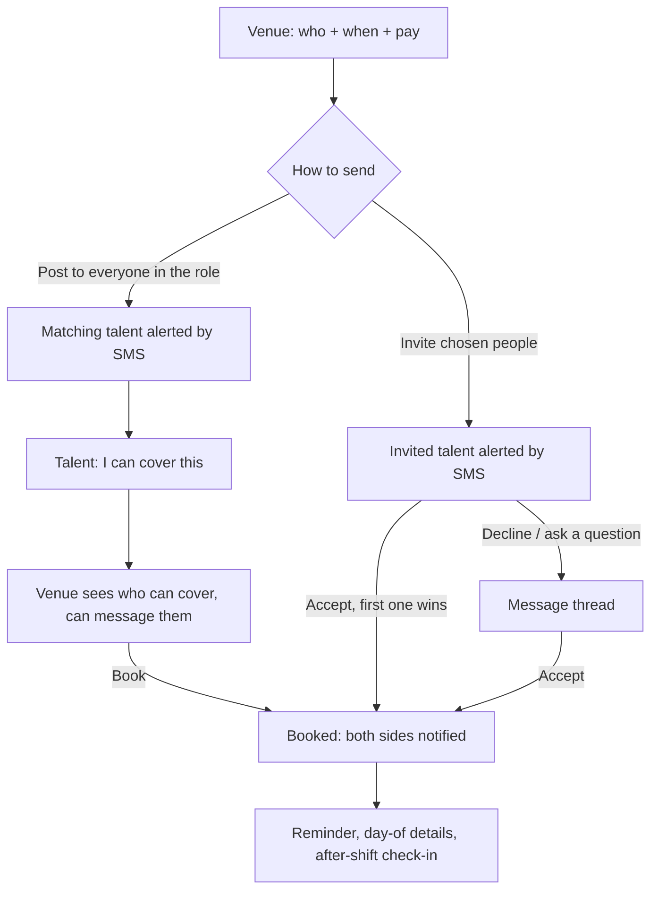

# Dyuknow: MVP user flow

Updated 2 October 2026 · Promoted from `MVP-preview` to the main demo app · See [MVP-preview-flowcharts.md](MVP-preview-flowcharts.md) for the flows as built

This version is built from the founder's answers:

- **Dyuknow is for cover.** Venues fill gaps for a service, a day or a few days. Permanent hiring is the long-term ambition but is out of scope.
- **The owner vets every member personally.** He is in the industry and onboards people he knows. There is no self-serve marketplace and no in-app review workflow.
- **Posting a shift is the main path.** It instantly alerts every member who works that role, and they respond. Inviting specific people is the second path.
- **Roles stay as the existing catalogue.** Skills come from a predefined list plus free text. They are shown on profiles but are not used for ranking.
- **Money is not handled in the app.** Pay is stated and agreed in the app. The venue pays the talent directly.

The visual language in the current screens stays: monochrome photography, Instrument Serif with Helvetica, the sage accent, and rounded floating cards.

## What the founding cohort tells us

Snapshot of `venue_profiles` and `talent_profiles` on 1 Oct 2026:

| | Members | What it means for the flow |
| --- | --- | --- |
| Venues | Spruce, The Sea The Sea, Harper Privé | Only The Sea The Sea said it needs same-day cover; the other two said **Planned** only. Tomorrow and Pick dates must be as easy as Today. |
| Chefs | 5 (Demi CDP up to Executive Chef) | Most posts will be chef posts. Chef grades must be selectable, because "a chef" covers everyone from a Demi CDP to an Executive Chef. |
| Front of house | 3 (host, waiter, manager, bartender) | Thin supply. An empty-result state with the owner as fallback is essential (see Rule 7). |
| Sommelier · Maître d' | 0 members | Added to the role catalogue (see below). Both need recruiting; until then, shifts for them fall back to the owner (Rule 7). |

Data hygiene: there is a duplicate "Ethan Russell" talent row. There are also 4 venue rows and 1 talent row with no name but `onboarding_completed_at` set. Check whether these are test submissions or a side effect of the save that now runs when the completion step opens.

## The words we use

| Word | Meaning | Where it appears |
| --- | --- | --- |
| **Shift** | What a venue needs: role, date(s), hours, pay, note. | Both sides. "Post a shift", "Shifts for you". |
| **I can cover this** | Talent's answer to a posted shift. | Talent button. Venue sees "3 can cover". |
| **Invite** | A venue asks one or more specific people to take a shift. | Venue button; "Spruce invited you" on the talent side. |
| **Book** | The venue picks someone who said they can cover. | Venue button on each response. |
| **Accept** | Talent takes an invitation. | Talent button on an invite. |
| **Booked** | Confirmed. Both sides are committed. | Status everywhere. |
| **Cancel booking** | Undoing a confirmed booking. Always needs a reason and always notifies the other side. | Booking detail only. |

Use "shift" and "cover" this way round. In restaurants "covers" means diners: The Larkspur's profile already says "42 covers nightly". A venue seeing "3 covers open" would misread it.

Avoid hire, recruit, worker, gig, apply and job title wording in the UI, to keep the curated tone from PRODUCT.md.

## The one rule everything follows

> **Two yeses make a booking. Whoever says yes second confirms it.**

- **Posted shift:** talent says *I can cover this* (yes #1), then the venue taps *Book* (yes #2). Booked.
- **Invite:** the venue sends the invite with full terms (yes #1), then talent taps *Accept* (yes #2). Booked.

Neither side is ever asked to confirm twice, and nobody is told "booked" and then un-booked. Before the second yes, either side can back out quietly. After it, the only way out is **Cancel booking**.

**No auto-booking, ever.** The venue always makes the final call on a posted shift.

**The yeses are per day.** A multi-day shift is a set of days, each with its own start and end. Talent ticks the days they can do. A booking covers only days both sides said yes to. The venue picks which of a person's offered days to book, can book different people on different days, and can add more of the same person's days later (that extends their booking rather than creating a second one). Days nobody has covered stay open for others.

**Each person must cover every day (optional).** When posting more than one day, the venue can switch this on (off by default). It works with any headcount: "2 people needed each day" plus this toggle means two people, each covering every day. Talent can then only offer every day, the venue can only book every day, and talent booked elsewhere on any of those days don't see the shift.

**Talent can always add days.** Someone waiting or already booked for some days can offer more of the open days later ("You're booked Thu 8 · Offer Fri 9"). The venue sees "can also cover" and books as usual.

When a shift needs one person and the venue invites three, the first to accept is booked. The other two see "This shift has been filled". The venue is told this before sending the invites. This replaces the brief's "venue pulls back after several accept": with this model that situation cannot happen.

## Rules that keep it reliable

1. **The server decides.** Book, Accept, Cancel and Withdraw each run as one database transaction. It checks that the shift is still open, that spots remain, that the response or invite is still live, that the shift has not started, and that the talent has no overlapping booking. If two taps race, one wins and the other gets an explanation.
2. **No double booking.** When talent is booked, the clashing days drop out of their other answers. An answer with no days left lapses, and that venue sees "Booked elsewhere".
3. **Nothing reserves time except a booking.** Saying "I can cover this" to two overlapping shifts is allowed; whichever books first wins (Rule 2).
4. **Terms cannot change after sending.** Role, dates, hours and pay are frozen once alerts go out. To change them, use *Edit and resend*: this closes the old shift, tells responders why, and posts a new one prefilled. The note can be edited freely.
5. **A shift closes day by day.** A day can't be offered or booked once it has started. The shift closes only when no day that still needs someone is in the future, and everyone still waiting is then told.
6. **A cancellation reopens the shift.** If a booked person cancels, the shift goes back to Open for the future days that now need someone. The venue sees "Theo cancelled · Tue 6 needs 1 more person" with **Text everyone again** and **Invite people**. People who were told "filled" can offer again.
7. **Chat never changes terms.** The pinned shift card at the top of a thread is the source of truth.
8. **The owner is the safety net.** If a same-day shift has no matching members, or no one has said they can cover within 30 minutes, the owner gets an SMS with the shift. He can work his phone. This concierge fallback is the premium promise, and it covers the thin supply honestly.
9. **No fake numbers.** No match percentages, invented scarcity ("4 viewing"), fake ratings or "verified" labels for checks that were not done.

## Navigation (mobile first: four labelled tabs per side)

| Venue | | Talent | |
| --- | --- | --- | --- |
| **Book** | Your open shifts with live status ("2 can cover · Review"), the role tiles, then Coming up. | **Shifts** | Next booking · Invited you · Waiting to hear · Shifts for you (no filters) · Venues toggle. |
| **Bookings** | One list: Needs you · Open · Coming up · Past and cancelled (collapsed). | **My shifts** | Availability strip · Coming up · Invited you · Waiting to hear · Past and closed (collapsed). |
| **Messages** | One thread per shift and person. Red dot when unread. | **Messages** | Same. |
| **Profile** | Venue profile, defaults, contact, sign out. | **Profile** | Public profile, roles and skills, alerts, sign out. |

There is no bell or notifications page. SMS does that job outside the app. Talent never gets notified about their own actions.

Tab badges: **Messages** shows a red dot for unread messages. **Bookings** and **My shifts** show a count of decisions waiting: responses to review on the venue side, invites to answer on the talent side. Reading a message clears the dot. Only acting clears a decision.

---

## Venue journeys

### V1 · Joining

1. On the landing page, tap **"I'm a venue"**.
2. Sign in with a **phone number and text code**. That one step verifies the number SMS alerts go to.
3. If the owner pre-loaded a venue whose contact phone matches, show "Is this The Sea The Sea?", so the venue confirms instead of filling the form again. Otherwise run the existing venue onboarding.
4. **Waiting for approval:** "We'll text you as soon as you're in." The profile can be edited; nothing else is available yet.
5. The owner approves. The venue gets an SMS and lands on **Book**.

The onboarding answers become **defaults** for every shift: dress code, uniform provided, staff meal, typical chef and front-of-house hourly rates, address and contact. Posting is fast because of this.

### V2 · Post a shift (the main path, about 30 seconds)

**Screen: Book.** The headline stays "Who do you need?". The role photography becomes the picker: Kitchen · Pastry · Bar · Sommelier · Floor.

**Role catalogue** (one list, shared by talent onboarding and shift posting):

| Tile | Positions |
| --- | --- |
| Kitchen | Demi CDP · CDP · Senior CDP · Junior Sous · Sous Chef · Head Chef · Executive Chef |
| Pastry | Pastry Chef |
| Bar | Bartender · Mixologist |
| Sommelier | Sommelier |
| Floor | Maître d' · Restaurant Manager · Supervisor · Section Waiter · Waiter · Host |

Sommelier and Maître d' are new. Adding them means updating `FOH_POSITIONS` in `lib/data.ts` and the `positions` check constraint on `talent_profiles`. Change both together, or onboarding submits that include a new role will fail.

**One screen, not three.** Tapping a tile opens a single form; the tab bar hides on phones so the action stays in reach.
- **Who:** grade chips with member counts ("CDP · 2"). Last time's grades and hours for this team are preselected.
- **When:** Today · Tomorrow · **Pick dates**, then "17:00 to 23:00". Pick dates shows the next 14 days; tap any of them (up to 7, not necessarily in a row). Every day has the same hours, and the form says "Same hours each day". For different hours, post a second shift. Overnight shows both dates. A start in the past is refused.
- **Each person must cover every day:** a toggle that appears once there's more than one day. Off by default, which allows partial cover. The headcount label becomes "People needed each day".
- **Pay** (£/hour, prefilled from the venue's rate; warning below £12.71) and **People** (stepper, 1–5) on one line.
- **Note:** prefilled from venue defaults, collapsed with an Edit link.
- **Duplicate check:** "You already have an open CDP shift at this time. View it".
- **Two sends that commit differently, each saying what happens:**
  - **Post shift:** "Texts Poppy and Theo. You review who can cover, then book." ("Ask Dyuknow to find someone" when nobody has the role.)
  - **Invite specific people:** "You choose who. Accepting books them straight away." The invite screen repeats this next to its button.
- **Drafts:** saved only after a real change. An unsent draft shows on home with exactly what it is ("Unsent changes to your CDP shift", "Unsent invite to Poppy") and **Continue** or **Discard**.

**After sending:** the venue's shift page opens. Toast: "Sent. Poppy and Theo have been texted."

### V3 · Invite specific people

Reached from "Choose who to invite" on the review sheet, or from **Book again** after a past booking.

The list contains every approved member in the chosen roles, in this order:
1. **Your people.** Anyone you have booked before.
2. **Free then.** Their availability covers the whole shift.
3. **Everyone else.** "Availability not set" is shown honestly; they can still be invited.

Each card shows the portrait or initials, name, grade, 2–3 skills, area and the availability line ("Free Fri 17:00–23:30"). Tapping a card opens the profile, with an **Invite** button that stays in reach.

Select one or more people, then **Send invite**. When there are more invitees than spots, a line explains: "First to accept is booked. Others will be told it's filled."

### V4 · Review responses and book

**Shift page** (written for the venue, no stock photo):

- **Top bar:** Back and a ⋯ menu (Invite more people · Edit note · Change time, pay or role · Close shift).
- **Header:** "CDP", then "Sun 4–Tue 6 Oct · 17:00–23:00 · £24/h · 2 people" and a status pill ("2 can cover · Review").
- **Day tracker** for multi-day shifts: one row per day with "Booked · Poppy" or "Open", who can cover it ("2 can cover: Poppy (Sun only), Theo (all 3 days)") and a **Book {name}** button per person for that day.
- **Booked:** rows for people already booked, with their days.
- **Can cover every day / Can cover some days:** rich cards with photo, positions, postcode area, "Worked with you", up to 3 skills, the bio (first 3 lines), what they offered ("Offered all 3 days (Sun filled)") and note, plus **Book Theo · 2 days** and **Message**. Button labels always name the days. "Worked with you" appears only when there is a past, uncancelled booking at this venue that the venue didn't flag as a no-show or problem.
- **Sent to / Everyone else:** who hasn't replied, who's invited, who declined or withdrew.
- **Status line** talks in people per day ("Mon 5, Tue 6 each need 1 more person"), never "days covered".
- **Nobody bookable:** if nobody has been booked yet, "No replies yet" with Invite more people and Ask Dyuknow to help. If someone has been (or was) booked, "Find cover for Tue 6" with Text everyone again and Invite people instead.

**Book Poppy** opens a confirm sheet where the venue ticks which of the offered, still-open days to book (all of them by default, or just the day tapped in the tracker). After booking the venue lands on **"Poppy's coming on Sun 4 Oct at 17:00"**, and the toast names anyone told it's filled.

A venue can **Message** anyone who responded before booking. This is the brief's "talk first, then book".

### V5 · After booking

- **Booking card** (Bookings → Upcoming): the person, dates and hours, pay, note, their phone number, and the thread.
- **Cancel booking:** asks for a reason (dropdown plus optional text) and states the affected dates. The talent gets an SMS immediately. Cancellations within 24 hours of the start are logged privately for the owner.
- **If the talent cancels**, the venue gets an SMS and the shift reopens for the affected future days (Rule 6). **Find a replacement** on the cancelled booking goes straight to that shift.
- **After the shift ends**, the venue gets one private question: "Did Poppy work this shift?" (Yes · No-show · There was an issue). Only the owner sees the answer. No public ratings yet.
- **Book again:** an invite to the same person, prefilled with the same role, hours and pay, asking only for new dates.

---

## Talent journeys

### T1 · Joining

1. On the landing page, tap **"I'm talent"**, then sign in with a phone code.
2. If the owner pre-loaded a profile with this phone number, they confirm it. Otherwise they run the existing talent onboarding.
3. **Skills:** the predefined chips plus an **"Add your own"** text field. Custom skills appear on the profile exactly as typed.
4. **Last step: "When are you free in the next 7 days?"** One tap per evening or day, editable later. It can be skipped with the line "You'll still get shift alerts for your roles."
5. **Waiting for approval**, then approval by SMS, then the **Shifts** tab.

### T2 · Get alerted and say "I can cover this"

1. SMS arrives: *"Dyuknow: Spruce needs a CDP, Fri 2 Oct 17:00–23:00, £18/h. View: dyuknow.com/s/abc"*.
2. The link opens the shift. Signed-in sessions persist, so there is no login wall each time.
3. **Shift detail:** role photo, venue name with its own small photo, dates and hours, pay, note, address area. The exact address shows once booked.
4. **"I can cover this"** sits in a sticky bar. It opens a sheet with an optional note. On a multi-day shift the sheet lists every day. Days they're booked elsewhere or already covered are greyed out. Days they marked Not free on their own calendar start unticked, with "You marked this day not free", but can be ticked. The button names what they're offering: **"Offer all 3 days"**, **"Offer 2 of 3 days"** or **"Offer 1 day (Thu only)"**. On a one-person-for-every-day shift, the days are fixed and the button is always "Offer all 3 days".
5. The bar becomes *"Waiting for Spruce · Sun 4, Mon 5 Oct. You're not booked yet."* with **Withdraw**.
6. It appears on home and in **My shifts → Waiting to hear**.

If the talent already has a booking that overlaps, the button is disabled with the line "You're booked at Harper Privé then".

### T3 · Answer an invite

1. SMS: *"Dyuknow: The Sea The Sea invited you, Sat 3 Oct 18:00–23:00, £20/h."*
2. The invite is pinned at the top of **Shifts** and counted on the **My shifts** badge.
3. The invite detail is the same layout as a shift, showing the one role they were invited for, with **Accept and book**, **Decline** and **Message**.
4. **Accept** opens a confirm sheet listing the days. Tap **Accept and book**. Booked.
5. On a multi-day invite there is also **I can do some days**. That becomes a normal response with ticked days, and nobody is booked until the venue confirms.
6. If someone else accepted first, show: "This shift has been filled." No error codes.

### T4 · Booked

- A calm confirmation screen: the venue, dates, hours, pay, the full address with a **Directions** link, the on-site contact, the note, and **Add to calendar**.
- **Reminder SMS:** at 18:00 the day before, or 2 hours before for a same-day booking.
- **Cancel booking:** asks for a reason and notifies the venue immediately.
- The booking appears in **My shifts → Upcoming**, then **Past**.

### T5 · Availability

- **Where:** a 14-day strip at the top of **My shifts**. Tap a day, then choose **Free all day**, **Free from–to**, or **Not free**.
- **Display:** booked days show the venue name. Days nobody has filled in show as blank, never as "available".
- **What it does:** it only helps venues who browse (V3). Shift alerts go to everyone with the role regardless.
- **Weekly nudge:** an SMS every Monday morning: "Free this week? Tap to update". This keeps the venue browse useful.

### T6 · Browse venues

The **Venues** toggle on the Shifts tab lists approved venues: photo, name, area and "2 open shifts". A venue profile shows its open shifts. There is no messaging a venue cold, and no follow or favourite in v1.

---

## Notifications

| Event | Who | In app | SMS |
| --- | --- | --- | --- |
| Shift posted | Talent in a matching role | Card in Shifts | Yes. Setting: All / Today and tomorrow only / Off |
| Invited | Invited talent | Pinned invite, badge | Yes |
| Someone can cover | Venue | Needs-you strip, badge | Yes, the first one immediately, then at most one per 15 minutes per shift |
| Booked | Both | Booking card | Yes, to the talent; the venue already knows |
| Filled / closed / edited and resent | Waiting responders | Status on their item | Yes, if same-day; otherwise in-app only |
| New message | Recipient | Red dot | Only if still unread after 10 minutes |
| Cancelled | The other side | Status and reason | Yes, immediately |
| Reminder | Talent | — | 18:00 the day before, or 2 hours before for same-day bookings |
| No match / no reply in 30 minutes (same-day) | Owner | — | Yes |
| Approved | New member | — | Yes |

The in-app state is the truth. An SMS that fails to send never undoes a booking. SMS links open a page; they never perform an action. An old link opens the current state, for example "This shift has been filled".

## Status reference

| Thing | States |
| --- | --- |
| Shift | Open → Filled → Done; Closed (by the venue); Expired (started unfilled) |
| Response (per shift and talent) | Invited · Can cover → Booked; Declined · Withdrawn · Not selected (filled) · Lapsed (booked elsewhere or started) |
| Booking | Booked → Done; Cancelled (by whom, reason, time) |

## Edge cases

| Situation | What happens |
| --- | --- |
| No members in that role | Review sheet says "No sommeliers on Dyuknow yet". The venue can still send, which alerts the owner, with the line "We'll try to find someone for you". |
| Nobody responds | The shift page shows when alerts went out. For same-day shifts the owner is alerted at 30 minutes (Rule 7). The venue can invite people directly. |
| Two venues book the same person for overlapping times | The first wins. The second sees "No longer available, booked elsewhere", with no details of the other venue. |
| Two invitees accept at the same moment | One is booked; the other sees "Filled a moment ago". |
| Talent withdraws while the venue taps Book | The server decides; both screens show the result. |
| Connection drops while booking or accepting | Show "Checking…" and refetch. Never show success before the server confirms. |
| Venue needs 2 people | People needed = 2. The shift stays open until both are booked. |
| Overnight shift | Both dates are shown. Overlap checks use real timestamps in the Europe/London timezone. |
| Pending (unapproved) account follows a link | Show "Your account is being reviewed" plus the shift summary, with no actions. |
| Talent no-show | The venue reports it from the booking. The owner follows up personally. **Find a replacement** opens a new prefilled shift if the original's days have passed. |

## Screen inventory

**Venue:**
- Book (home)
- Role sheet
- When sheet
- Review sheet
- Choose who to invite
- Talent profile
- Bookings (Open, Upcoming, Past)
- Shift page
- Booking detail
- Messages
- Thread
- Profile and defaults
- Onboarding
- Waiting for approval

**Talent:**
- Shifts (Shifts and Venues toggle)
- Shift and invite detail
- Venue profile
- My shifts (availability strip, Upcoming, Waiting, Past)
- Day availability sheet
- Booking detail
- Messages
- Thread
- Profile and alert settings
- Onboarding
- Waiting for approval

**Owner (minimal):** approve members, and see all shifts and bookings with their status. This can start as Supabase table views and grow into a small `/admin` page.

## Out of scope for this MVP

Payments, invoices and payroll; ratings and reviews; match scores; skill-based ranking; different hours per day within one shift; editing a booked shift (cancel and rebook instead); talent messaging venues cold; favourites and follows; WhatsApp and push notifications; multiple managers or locations per venue; permanent hiring; native app.

## Technical shape (brief)

- **Auth:** Supabase Auth with phone OTP, using Twilio as the SMS provider. Sign-in and the verified alert number are the same thing. Clerk is not needed.
- **Data:**
  - Existing `venue_profiles` and `talent_profiles`, plus `approved_at` and `custom_skills`.
  - New tables: `availability`, `shifts`, `shift_days`, `responses` (unique per shift and talent, covering invites and volunteers), `bookings`, `threads`, `messages`, `notifications`.
  - A Postgres exclusion constraint on booked time ranges per talent as the final guard against double booking.
- **Actions:** `book_response`, `accept_invite`, `withdraw`, `cancel_booking` and `close_shift` as Postgres functions (RPC). Clients never write status columns directly. RLS limits rows to their participants.
- **Live updates:** Supabase Realtime for responses and chat, with a refetch on reconnect.
- **Outbound SMS:** a `notifications` row is written in the same transaction as the state change. An Edge Function sends it, and `pg_cron` retries failures and runs reminders, shift expiry, the Monday nudge and the owner's 30-minute alert.

## Open decisions for the owner

1. **Phone sign-in** instead of email: confirm.
2. **Pay visible to all talent** on every shift (recommended: yes).

## Parked

- **The landing page promise** of verified right to work, DBS checks, food hygiene certificates, insurance and HMRC requirements. Onboarding collects uploads, but nobody checks them yet. Revisit before real bookings rely on it.
